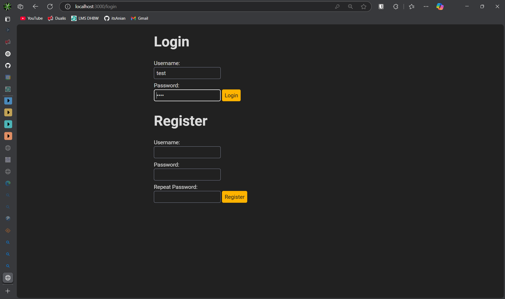
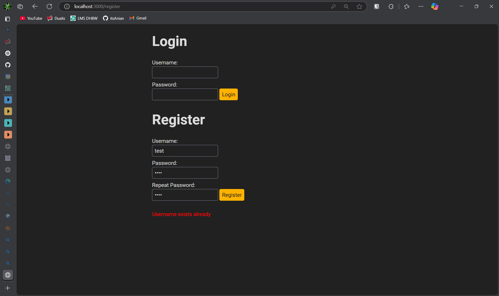
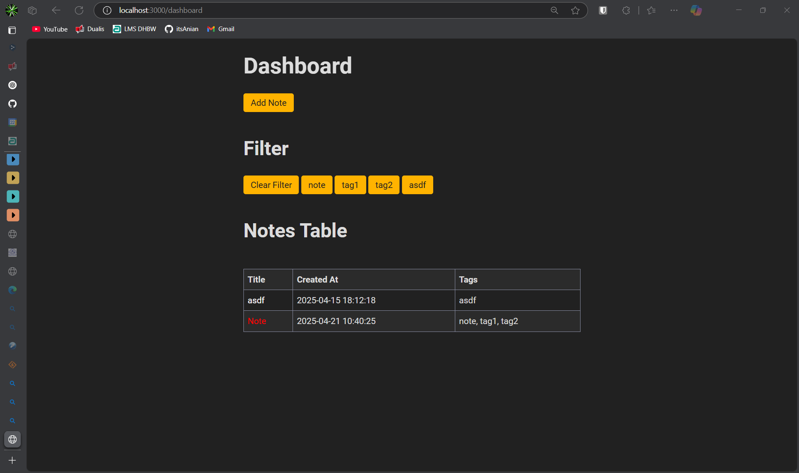
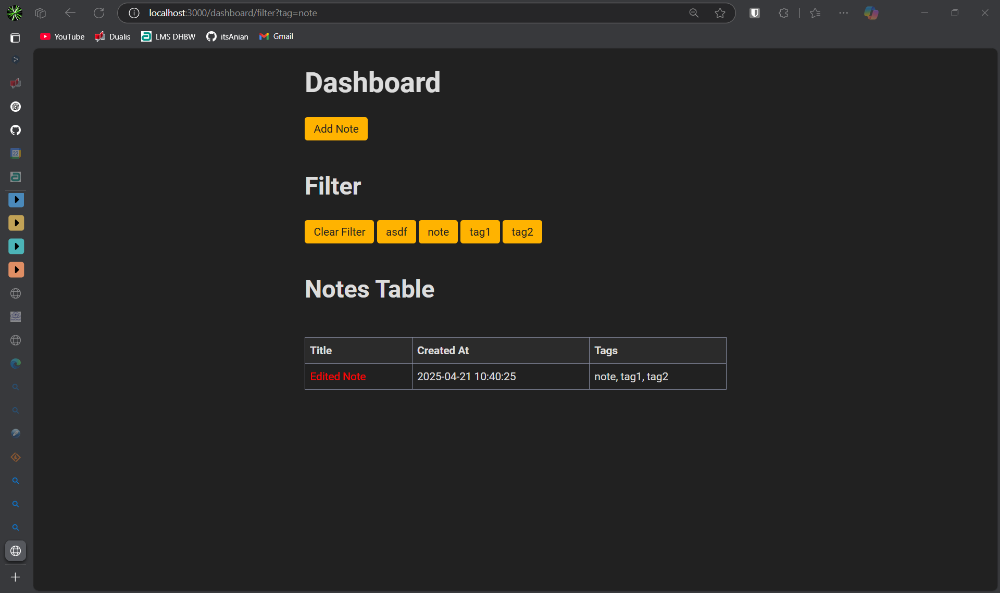
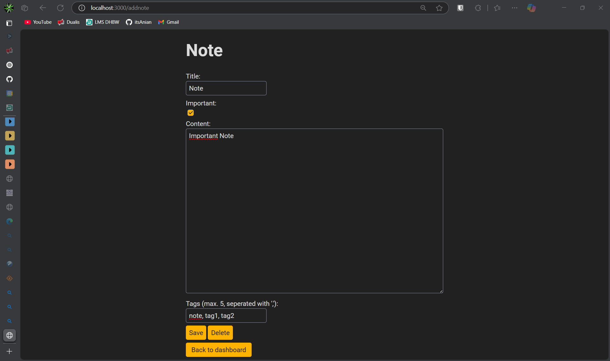
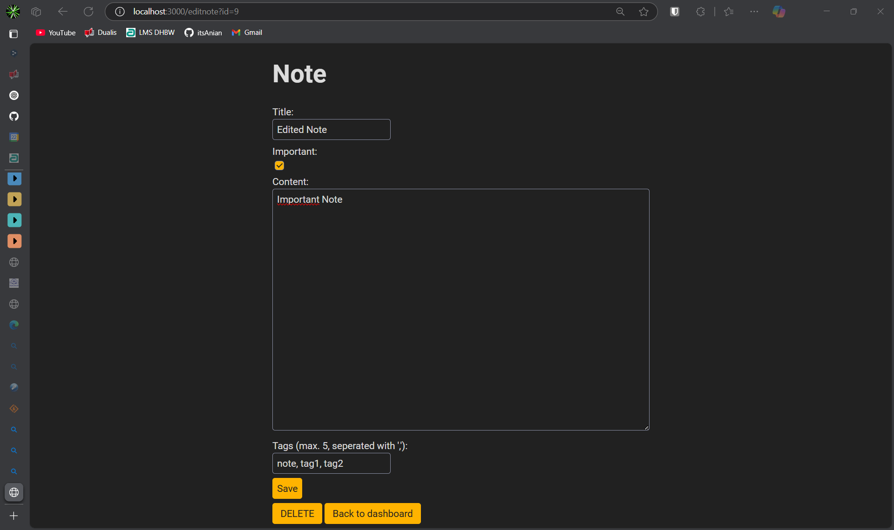

# Notes

## Setup
1. Clone the repository 
2. Navigate into the Repository 
3. execute `docker build -t notes_nodejs .` (Creates Docker Image) 
4. execute `docker run -p 3000:3000 notes_nodejs` (Starts up the Docker container and installs the requiered npm packages based on the nix flake and runs npm) 
6. navigate to `localhost:3000` in your browser 

## List of used technologies 
- Node.js 
- Express 
- Template Engine EJS 
- Database: sqlite3 (from npm packages)

## Functions:
- register a new account 
- login to existing account 
- list the notes on the dashboard 
- filter the notes on the dashboard for a specific tag 
- clear the tag 
- sort for creation date of the note with clicking onto the created column 
- create a new note (title, important toggle, content, 1-5 tags (autogenerated creation date)) 
- edit a note, with clicking on the name 
- delete a note with opening it and then click on the delete button 

## Screenshots

