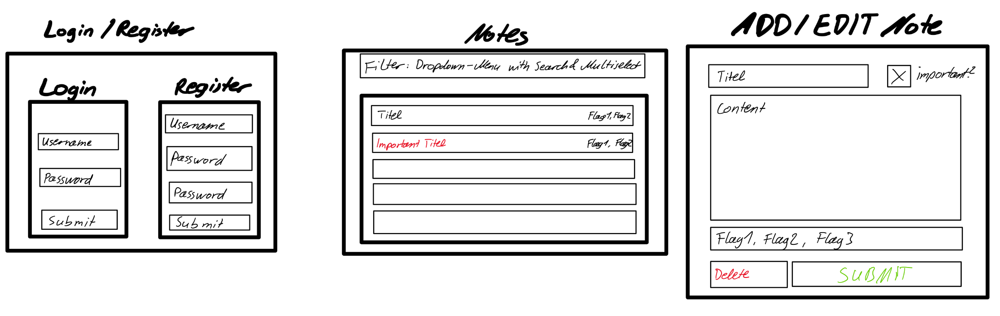

# Planning

### Database:
```sql
Table tags {
  id integer [primary key]
  tag varchar
  note_id integer
}

Table users {
  id integer [primary key]
  username varchar [unique]
  password varchar
}

Table notes {
  id integer [primary key]
  user_id integer
  title varchar
  content text
  important bool
  created_at timestamp
}

Ref notes_tags: tags.note_id > notes.id
Ref notes_users: notes.user_id > users.id
```

### Website:
- Login-Site
- Dashboard (shows all notes, highlights important one, filter for tags)
- Add Note Site (form to fill in the title, content, tags, toggle for important)
- Edit Note Site (restores the note into the form and updates it, if its changed)
- Provide a Delete Note button (at Dashboard Site and Edit Note Site)


